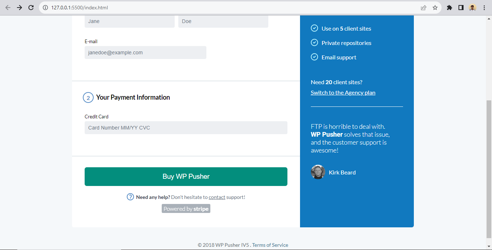

# WP Pusher

A practice website in preparation for our first semester exam at AltSchool Africa.

## Table of contents

- [Overview](#overview)
  - [The challenge](#the-challenge)
  - [Screenshot](#screenshot)
  - [Links](#links)
- [My process](#my-process)
  - [Built with](#built-with)
  - [What I learned](#what-i-learned)
  - [Continued development](#continued-development)

## Overview

### The challenge

Users should be able to:

- View the optimal layout for the site on larger screens
- It was not to be made responsive.

### Screenshot

### Links

- Solution URL: [Github Repository](https://github.com/Saheedatt/wp-pusher)
- Live Site URL: [WP pusher](https://wppusher.netlify.app/)

## My process

### Built with

- Semantic HTML5 markup
- CSS custom properties
- Flexbox
- CSS Grid

### What I learned

- I learnt about the appropriate use of css nesting.
- I was able to use grid layout for the project
- I was able to make my website more accessible using the WCAG guidelines
- I struggled with making my skip-navigation more functional without using JavaScript.

### Continued development
- In the future, I plan to use Grid layout more efficiently.